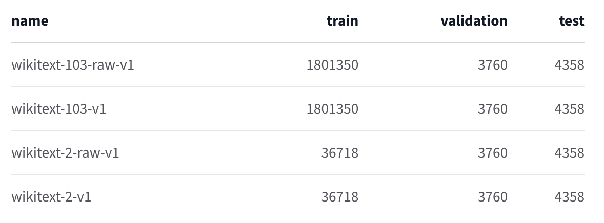
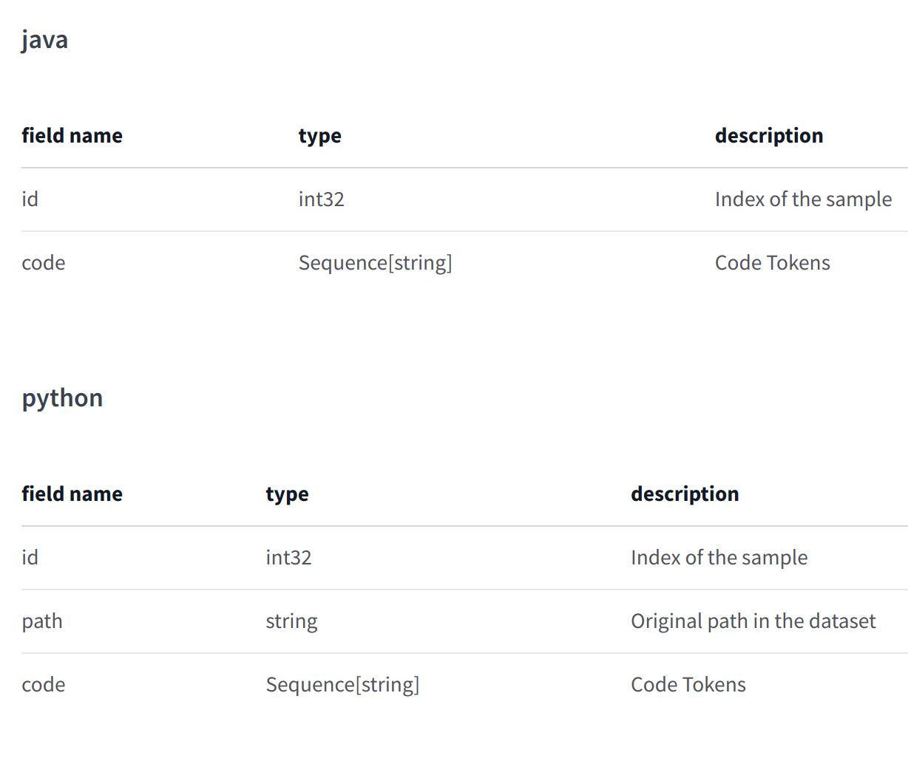
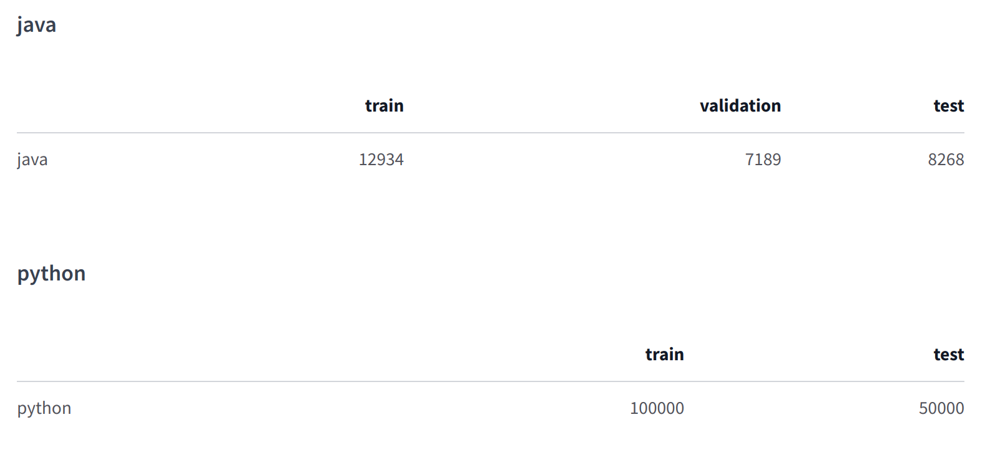

# Datasets

- Using https://huggingface.co/datasets/

## [Wikitext](https://huggingface.co/datasets/wikitext)

The WikiText language modeling dataset is a collection of over 100 million tokens extracted from the set of verified
Good and Featured articles on Wikipedia. The dataset is available under the Creative Commons Attribution-ShareAlike
License.

- wikitext-103-raw-v1
	- Size of downloaded dataset files: 183.09 MB
	- Size of the generated dataset: 523.97 MB
	- Total amount of disk used: 707.06 MB
- wikitext-103-v1
	- Size of downloaded dataset files: 181.42 MB
	- Size of the generated dataset: 522.66 MB
	- Total amount of disk used: 704.07 MB
- wikitext-2-raw-v1
	- Size of downloaded dataset files: 4.50 MB
	- Size of the generated dataset: 12.91 MB
	- Total amount of disk used: 17.41 MB
- wikitext-2-v1
	- Size of downloaded dataset files: 4.27 MB
	- Size of the generated dataset: 12.72 MB
	- Total amount of disk used: 16.99 MB



## [Wikipedia](https://huggingface.co/datasets/wikipedia)

Wikipedia dataset containing cleaned articles of all languages. The datasets are built from the Wikipedia
dump (https://dumps.wikimedia.org/) with one split per language. Each example contains the content of one full Wikipedia
article with cleaning to strip markdown and unwanted sections (references, etc.).

To load this dataset you need to install Apache Beam and mwparserfromhell first:

```
pip install apache_beam mwparserfromhell
```

The list of pre-processed subsets is:

* "20220301.de"
* **"20220301.en"**
* "20220301.fr"
* "20220301.frr"
* "20220301.it"
* "20220301.simple"

### 20220301.en

* Size of downloaded dataset files: 20598.31 MB
* Size of the generated dataset: 20275.52 MB
* Total amount of disk used: 40873.83 MB

### Data Fields

The data fields are the same among all configurations:

* id (str): ID of the article.
* url (str): URL of the article.
* title (str): Title of the article.
* text (str): Text content of the article.

An example looks as follows:

```
{'id': '1',
'url': 'https://simple.wikipedia.org/wiki/April',
'title': 'April',
'text': 'April is the fourth month...'
}
```

## [CodeXGLUE CodeCompletion-token dataset](https://huggingface.co/datasets/code_x_glue_cc_code_completion_token)

CodeXGLUE CodeCompletion-token dataset, available
at https://github.com/microsoft/CodeXGLUE/tree/main/Code-Code/CodeCompletion-token

Predict next code token given context of previous tokens. Models are evaluated by token level accuracy. Code completion
is a one of the most widely used features in software development through IDEs. An effective code completion tool could
improve software developers' productivity. We provide code completion evaluation tasks in two granularities -- token
level and line level. Here we introduce token level code completion. Token level task is analogous to language modeling.
Models should have be able to predict the next token in arbitary types.

### Languages

* Java programming language
* Python programming language

### Data Instances

#### java

An example of 'test' looks as follows.

```
{
"code": ["<s>", "package", "org", ".", "vaadin", ".", "teemu", ".", "clara", ".", "demo", ";", "import", "java", ".", "io", ".", "BufferedReader", ";", "import", "java", ".", "io", ".", "ByteArrayInputStream", ";", "import", "java", ".", "io", ".", "IOException", ";", "import", "java", ".", "io", ".", "InputStreamReader", ";", "import", "org", ".", "vaadin", ".", "teemu", ".", "clara", ".", "Clara", ";", "import", "org", ".", "vaadin", ".", "teemu", ".", "clara", ".", "inflater", ".", "LayoutInflaterException", ";", "import", "com", ".", "vaadin", ".", "Application", ";", "import", "com", ".", "vaadin", ".", "terminal", ".", "ThemeResource", ";", "import", "com", ".", "vaadin", ".", "ui", ".", "Button", ";", "import", "com", ".", "vaadin", ".", "ui", ".", "Button", ".", "ClickEvent", ";", "import", "com", ".", "vaadin", ".", "ui", ".", "Component", ";", "import", "com", ".", "vaadin", ".", "ui", ".", "Embedded", ";", "import", "com", ".", "vaadin", ".", "ui", ".", "HorizontalLayout", ";", "import", "com", ".", "vaadin", ".", "ui", ".", "HorizontalSplitPanel", ";", "import", "com", ".", "vaadin", ".", "ui", ".", "TextArea", ";", "import", "com", ".", "vaadin", ".", "ui", ".", "VerticalLayout", ";", "import", "com", ".", "vaadin", ".", "ui", ".", "Window", ";", "import", "com", ".", "vaadin", ".", "ui", ".", "Window", ".", "Notification", ";", "@", "SuppressWarnings", "(", "\"serial\"", ")", "public", "class", "DemoApplication", "extends", "Application", "{", "private", "DemoController", "controller", ";", "private", "TextArea", "xmlArea", ";", "private", "HorizontalSplitPanel", "split", "=", "new", "HorizontalSplitPanel", "(", ")", ";", "private", "Window", "mainWindow", ";", "@", "Override", "public", "void", "init", "(", ")", "{", "setTheme", "(", "\"clara\"", ")", ";", "setMainWindow", "(", "mainWindow", "=", "new", "Window", "(", ")", ")", ";", "controller", "=", "new", "DemoController", "(", "mainWindow", ")", ";", "mainWindow", ".", "setContent", "(", "split", ")", ";", "VerticalLayout", "editor", "=", "new", "VerticalLayout", "(", ")", ";", "editor", ".", "setSpacing", "(", "true", ")", ";", "editor", ".", "setMargin", "(", "false", ",", "false", ",", "false", ",", "true", ")", ";", "editor", ".", "setHeight", "(", "\"100%\"", ")", ";", "editor", ".", "addComponent", "(", "xmlArea", "=", "createXmlArea", "(", ")", ")", ";", "editor", ".", "setExpandRatio", "(", "xmlArea", ",", "1.0f", ")", ";", "editor", ".", "addComponent", "(", "createUpdateButton", "(", ")", ")", ";", "HorizontalLayout", "wrapper", "=", "new", "HorizontalLayout", "(", ")", ";", "wrapper", ".", "setMargin", "(", "true", ")", ";", "wrapper", ".", "setSizeFull", "(", ")", ";", "wrapper", ".", "addComponent", "(", "createLogo", "(", ")", ")", ";", "wrapper", ".", "addComponent", "(", "editor", ")", ";", "wrapper", ".", "setExpandRatio", "(", "editor", ",", "1.0f", ")", ";", "split", ".", "setFirstComponent", "(", "wrapper", ")", ";", "updateLayout", "(", ")", ";", "}", "private", "Component", "createLogo", "(", ")", "{", "Embedded", "logo", "=", "new", "Embedded", "(", "null", ",", "new", "ThemeResource", "(", "\"\"", ")", ")", ";", "logo", ".", "setHeight", "(", "\"90px\"", ")", ";", "logo", ".", "setWidth", "(", "\"90px\"", ")", ";", "return", "logo", ";", "}", "private", "TextArea", "createXmlArea", "(", ")", "{", "TextArea", "area", "=", "new", "TextArea", "(", ")", ";", "area", ".", "setStyleName", "(", "\"xml-area\"", ")", ";", "area", ".", "setSizeFull", "(", ")", ";", "area", ".", "setValue", "(", "readStartingPoint", "(", ")", ")", ";", "return", "area", ";", "}", "private", "Button", "createUpdateButton", "(", ")", "{", "return", "new", "Button", "(", "\"Update\"", ",", "new", "Button", ".", "ClickListener", "(", ")", "{", "public", "void", "buttonClick", "(", "ClickEvent", "event", ")", "{", "updateLayout", "(", ")", ";", "}", "}", ")", ";", "}", "private", "String", "readStartingPoint", "(", ")", "{", "BufferedReader", "reader", "=", "null", ";", "try", "{", "reader", "=", "new", "BufferedReader", "(", "new", "InputStreamReader", "(", "getClass", "(", ")", ".", "getClassLoader", "(", ")", ".", "getResourceAsStream", "(", "\"\"", ")", ")", ")", ";", "StringBuilder", "xml", "=", "new", "StringBuilder", "(", ")", ";", "String", "line", ";", "while", "(", "(", "line", "=", "reader", ".", "readLine", "(", ")", ")", "!=", "null", ")", "{", "xml", ".", "append", "(", "line", ")", ";", "xml", ".", "append", "(", "\"n\"", ")", ";", "}", "return", "xml", ".", "toString", "(", ")", ";", "}", "catch", "(", "IOException", "e", ")", "{", "e", ".", "printStackTrace", "(", ")", ";", "}", "finally", "{", "if", "(", "reader", "!=", "null", ")", "{", "try", "{", "reader", ".", "close", "(", ")", ";", "}", "catch", "(", "IOException", "e", ")", "{", "e", ".", "printStackTrace", "(", ")", ";", "}", "}", "}", "return", "null", ";", "}", "private", "void", "updateLayout", "(", ")", "{", "try", "{", "Component", "c", "=", "Clara", ".", "create", "(", "new", "ByteArrayInputStream", "(", "xmlArea", ".", "getValue", "(", ")", ".", "toString", "(", ")", ".", "getBytes", "(", ")", ")", ",", "controller", ")", ";", "split", ".", "replaceComponent", "(", "split", ".", "getSecondComponent", "(", ")", ",", "c", ")", ";", "}", "catch", "(", "LayoutInflaterException", "e", ")", "{", "mainWindow", ".", "showNotification", "(", "e", ".", "getMessage", "(", ")", ",", "Notification", ".", "TYPE_ERROR_MESSAGE", ")", ";", "}", "}", "}", "</s>"],
"id": 0
}
```

#### python

An example of 'train' looks as follows.

```
{
"code": ["<s>", "from", "bootstrap", "import", "Bootstrap", "<EOL>", "from", "fund", "import", "InstantPaymentNotificationHandler", "<EOL>", "from", "fund", "import", "ThankYouHandler", "<EOL>", "from", "view", "import", "*", "<EOL>", "mapping", "=", "[", "(", "<EOL>", "r'/'", ",", "<EOL>", "Index", "<EOL>", ")", ",", "(", "<EOL>", "r'/ipn'", ",", "<EOL>", "InstantPaymentNotificationHandler", "<EOL>", ")", ",", "(", "<EOL>", "r'/thank-you'", ",", "<EOL>", "ThankYouHandler", "<EOL>", ")", ",", "(", "<EOL>", "r'/about\\/?'", ",", "<EOL>", "About", "<EOL>", ")", ",", "(", "<EOL>", "r'/guide\\/?'", ",", "<EOL>", "Guide", "<EOL>", ")", ",", "(", "<EOL>", "r''", ",", "<EOL>", "Download", "<EOL>", ")", ",", "(", "<EOL>", "r''", ",", "<EOL>", "Standards", "<EOL>", ")", ",", "(", "<EOL>", "r'/community\\/?'", ",", "<EOL>", "Community", "<EOL>", ")", ",", "(", "<EOL>", "r'/news\\/?'", ",", "<EOL>", "News", "<EOL>", ")", ",", "(", "<EOL>", "r'/support\\/?'", ",", "<EOL>", "Support", "<EOL>", ")", ",", "(", "<EOL>", "r'/contact\\/?'", ",", "<EOL>", "Contact", "<EOL>", ")", ",", "(", "<EOL>", "r'/press\\/?'", ",", "<EOL>", "Press", "<EOL>", ")", ",", "(", "<EOL>", "r'/legal/terms'", ",", "<EOL>", "Terms", "<EOL>", ")", ",", "(", "<EOL>", "r'/library\\/?'", ",", "<EOL>", "Library", "<EOL>", ")", ",", "(", "<EOL>", "r''", ",", "<EOL>", "Library", "<EOL>", ")", ",", "(", "<EOL>", "r''", ",", "<EOL>", "Library", "<EOL>", ")", ",", "(", "<EOL>", "r''", ",", "<EOL>", "Users", "<EOL>", ")", ",", "(", "<EOL>", "r''", ",", "<EOL>", "User", "<EOL>", ")", ",", "(", "<EOL>", "r''", ",", "<EOL>", "Design", "<EOL>", ")", ",", "(", "<EOL>", "r''", ",", "<EOL>", "Design", "<EOL>", ")", ",", "(", "<EOL>", "r''", ",", "<EOL>", "Design", "<EOL>", ")", ",", "(", "<EOL>", "r''", ",", "<EOL>", "Design", "<EOL>", ")", ",", "(", "<EOL>", "r''", ",", "<EOL>", "Design", "<EOL>", ")", ",", "(", "<EOL>", "r''", ",", "<EOL>", "RedirectSuccess", "<EOL>", ")", ",", "(", "<EOL>", "r''", ",", "<EOL>", "RedirectError", "<EOL>", ")", ",", "(", "<EOL>", "r''", ",", "<EOL>", "RedirectAfterDelete", "<EOL>", ")", ",", "(", "<EOL>", "r''", ",", "<EOL>", "Moderate", "<EOL>", ")", ",", "(", "<EOL>", "r''", ",", "<EOL>", "Bootstrap", "<EOL>", ")", ",", "(", "<EOL>", "r'/activity'", ",", "<EOL>", "ActivityScreen", "<EOL>", ")", ",", "(", "<EOL>", "r'/txns'", ",", "<EOL>", "TxnList", "<EOL>", ")", ",", "(", "<EOL>", "r''", ",", "<EOL>", "Base64Blob", "<EOL>", ")", ",", "(", "<EOL>", "r''", ",", "<EOL>", "Base64Blob", "<EOL>", ")", ",", "(", "<EOL>", "r''", ",", "<EOL>", "MessageStrings", "<EOL>", ")", ",", "(", "<EOL>", "r'/.*'", ",", "<EOL>", "NotFound", "<EOL>", ")", "<EOL>", "]", "</s>"],
"id": 0,
"path": "00/wikihouse/urls.py\n"
}
```

### Data Fields

In the following each data field in go is explained for each config. The data fields are the same among all splits.



### Data Splits


